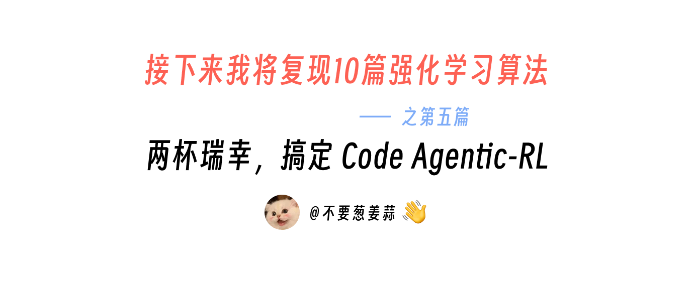
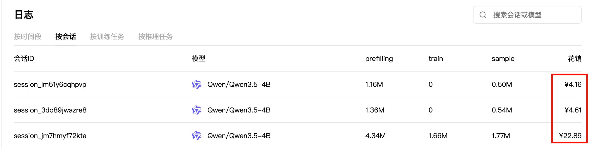
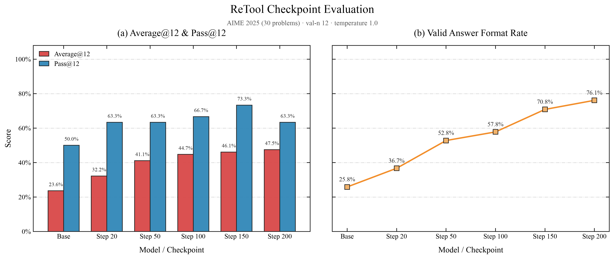
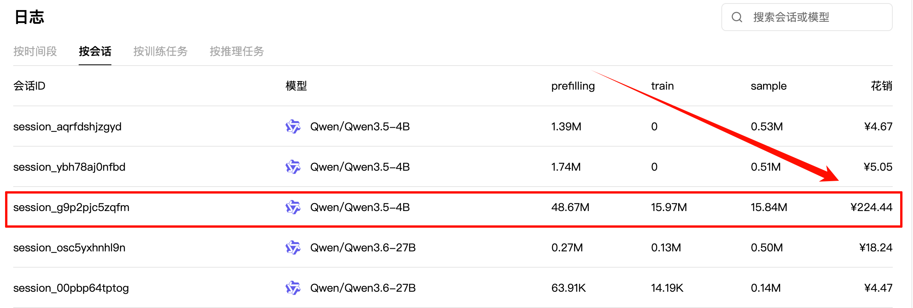
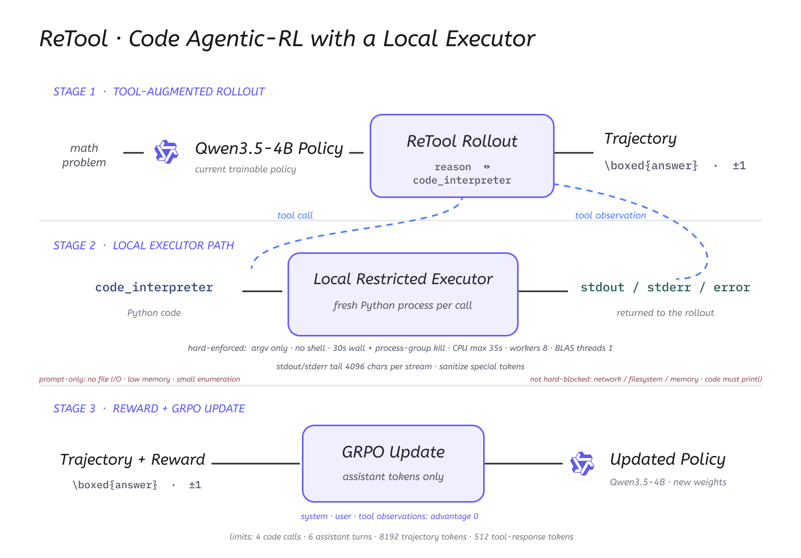
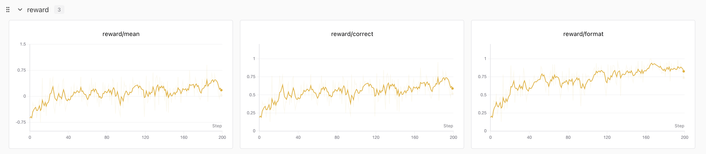
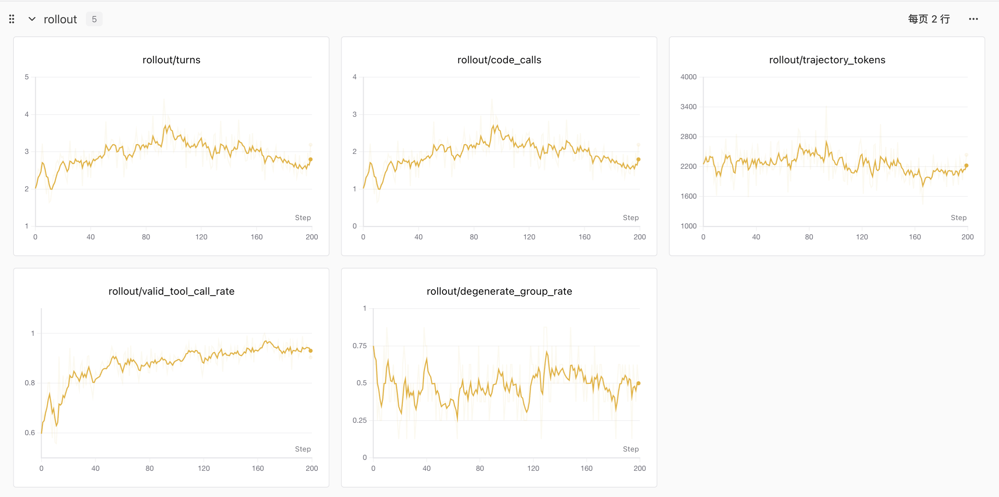
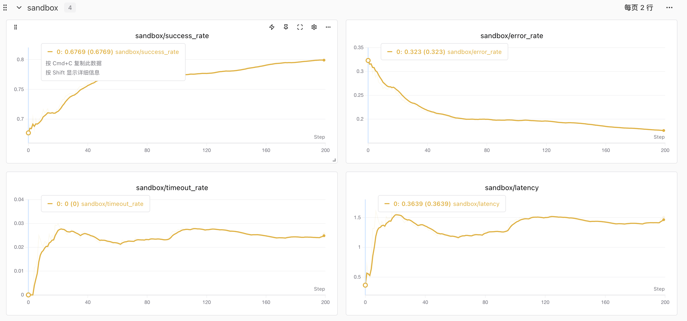

# 接下来我将复现 10 篇强化学习算法：第 5 篇，两杯瑞幸，搞定 ReTool

> 想跳过正文直接运行？请查看 [快速启动指南](./start.md)：准备数据 → 训练 → 评测。



<div align="center">
  <a href="https://www.zhihu.com/people/feng-qi-xia-pian" target="_blank"></a>
  <a href="https://www.xiaohongshu.com/user/profile/63c2055e000000002502c58c" target="_blank"></a>
  <a href="https://github.com/KMnO4-zx/agentic-rl-lab"></a>
</div>

> **代码与复现资源**
>
> - 本文完整代码：[KMnO4-zx/agentic-rl-lab/05-retool](https://github.com/KMnO4-zx/agentic-rl-lab/tree/main/05-retool)
> - ReTool 训练脚本：[05-retool/train.py](https://github.com/KMnO4-zx/agentic-rl-lab/blob/main/05-retool/train.py)
> - SwanLab 训练记录：[查看完整实验曲线](https://swanlab.cn/@kmno4/llm-agent-rl-lab-retool/overview)
> - ReTool 论文：[ReTool: Reinforcement Learning for Strategic Tool Use in LLMs](https://arxiv.org/abs/2504.11536)
> - PyTRIO 文档：[https://docs.pytrio.com/docs](https://docs.pytrio.com/docs)
> - PyTRIO 是什么？：[知乎介绍](https://zhuanlan.zhihu.com/p/2063265307226019219)
> - PyTRIO Skill：[SwanHubX/pytrio-skill](https://github.com/SwanHubX/pytrio-skill)

这是“接下来我将复现 10 篇强化学习算法”系列的第五篇。

前面几篇分别讲了：

- [第 0 篇：强化学习基础——损失函数](https://github.com/KMnO4-zx/agentic-rl-lab/blob/main/00-loss-function/readme.md)
- [第 1 篇：GRPO](https://github.com/KMnO4-zx/agentic-rl-lab/blob/main/01-grpo/readme.md)
- [第 2 篇：OPD](https://github.com/KMnO4-zx/agentic-rl-lab/blob/main/02-opd/readme.md)
- [第 3 篇：一杯喜茶，搞定 Search-R1](https://github.com/KMnO4-zx/agentic-rl-lab/blob/main/03-search-r1/readme.md)
- [第 4 篇：一顿疯狂星期四，搞定 OPSD](https://github.com/KMnO4-zx/agentic-rl-lab/blob/main/04-opsd/readme.md)

这一次的工具更“硬”一些：**ReTool，让模型在做数学题的 long CoT 里，自己决定什么时候写一段 Python 来算、算什么**。

翻译成人话就是：

> 模型一边打草稿一边做题，算不动的地方随手写段代码跑一下，考完只看最后答案对不对——没人教它什么时候该用计算器，这个习惯是它自己练出来的。

先说成本。验证这套算法链路有效，只需要两杯瑞幸。

我先用 20 个 step 做了一次验证跑，确认闭环成立。这次验证跑的账单是：

```text
训练会话（20 step）:  ¥22.89   （4.34M prefilling / 1.66M train / 1.77M sample）
AIME25 评测 × 2:     ¥4.16 + ¥4.61   （Base、Step 20）
合计:                ¥31.66
```



瑞幸一杯大概 `13～16` 元，两杯 `26～32` 元，所以标题没有夸张：两杯瑞幸的钱，就足够确认 ReTool 值得继续往下跑。

这 20 个 step 里已经能看到行为变化：

```text
correct（前 10 步均值 → 后 10 步均值）:  0.289 → 0.389
code_calls:                              1.24 → 1.72
degenerate group（整组无梯度）:           0
```

训练曲线之外，评测也在同一个窗口给出了正反馈。这是我们的 checkpoint 评测结果，后面「先看实验结果」一节还会完整展开这张图，现在可以先看 Base 和 Step 20：



```text
Base Model:  Average@12 23.61% · Format 25.83%
Step 20:     Average@12 32.22% · Format 36.67%
```

确认有效之后，我用同一份配置把一条轨迹跑满 200 个 step，这是真正出结果的训练：

```text
训练会话（200 step）:  ¥224.44   （48.67M prefilling / 15.97M train / 15.84M sample）
```



评测是另一笔小钱。Base 加上 5 个 checkpoint 一共评了 6 次 AIME25（30 道题 × 每题 12 次采样），每次约 `¥4～5`。

把所有能明确归属的放在一起：

```text
训练（验证跑 + 200 步轨迹）:  ¥22.89 + ¥224.44 = ¥247.33
评测（截图中 4 次）:           ¥18.49   （另有 2 次未入镜，每次约 ¥4～5）
```

## ReTool 是从哪里来的？

ReTool 是字节跳动 Seed 团队在 2025 年 4 月放出来的一项工作，全名是：

> ReTool: Reinforcement Learning for Strategic Tool Use in LLMs

它想解决的问题很直接。

long CoT 推理让模型的数学能力上了一个台阶，但纯文本推理有一个绕不开的弱点：**复杂计算只能靠“心算”**。一道需要开根号、解高次方程或者大规模枚举的题，模型在草稿纸上算得越多，越容易在中间某一步算错，而且错了自己不知道。

ReTool 的思路是：既然人做数学题会用计算器，那就让模型在推理过程中也能写代码。论文的两个关键设定：

1. **Code-interlaced rollout**：模型生成到代码就暂停，沙箱执行代码，把 stdout/stderr 拼回上下文继续生成；代码解释器返回的 token 不参与 loss。
2. **Outcome-only reward**：不奖励“用了代码”这个行为本身，只奖励最终答案正确。什么时候该调代码、调几次，完全是从结果里涌现出来的。

论文的完整流程还有一个 cold-start SFT 阶段（先用人工构造的代码交织轨迹教格式），以及 SandboxFusion 异步沙箱、KV cache 复用这些工程优化。这篇复现会说明哪些我们照搬了、哪些省掉了。

## 用人话解释 ReTool

可以把模型想象成一个正在考数学的学生，我们给他发了一台“用完即清零”的计算器：

- 草稿必须自己打，但算不动的地方可以写一段代码让计算器跑；
- 计算器没有记忆，每次按完就清零，想看结果必须让它把数字打印出来；
- 判卷只看最后写在答题框里的答案，对 +1、错 −1。

没有人告诉这个学生“第三位小数的开方应该用计算器”。他一开始可能该用不用、或者什么事都交给计算器；但只要对的题加分、错的题扣分，慢慢就会自己长出策略：**心算靠谱的继续心算，复杂计算交给代码**。

## 我们是怎么复现的？

复现只保留论文最核心的算法结构，工程实现围绕三件事展开：

- **工具协议**（[`protocol.py`](https://github.com/KMnO4-zx/agentic-rl-lab/blob/main/05-retool/protocol.py)）：把代码解释器声明成模型的原生工具，定义 system prompt 和 `<tool_call>` 解析；
- **本地执行沙箱**（[`sandbox.py`](https://github.com/KMnO4-zx/agentic-rl-lab/blob/main/05-retool/sandbox.py)）：每段代码起一个全新 Python 进程执行，带超时和资源约束；
- **结果奖励**（[`reward.py`](https://github.com/KMnO4-zx/agentic-rl-lab/blob/main/05-retool/reward.py)）：只看最终 `\boxed{}` 答案的数学等价判定，对 +1 / 错 −1。

在此之上，多轮工具轨迹的 rollout 状态机、GRPO 组内 advantage 和 PyTRIO 训练循环，沿用的是这个系列前几篇已经验证过的骨架。

复现架构如下，三个阶段对应的预算和硬约束都标在图里：



几个关键决策：

- **不引入任何特殊 token 或代码围栏**。code 直接走 Qwen 原生的 `<tool_call>` 协议，模型用原生格式发起调用，沙箱执行后以 `role: "tool"` 消息返回 stdout/stderr。论文用代码块触发的 code-interlaced 生成，功能上与原生 tool call 等价，但原生协议不需要动 tokenizer 和 chat template，工程上干净得多。
- **跳过 cold-start SFT，直接对 base 做 RL**。这是论文流程里我们省掉的最大一块。依据是 base 模型的 smoke test：2 道题 × 8 条轨迹，工具调用率 `87.5%`（14/16）、合法调用率 `85.4%`，组内 reward 有正有负，GRPO 信号健康——不需要先教格式。
- **reward 对齐官方代码**：只取回答最后 300 个字符、提取最后一个 `\boxed{}`、用 `math_verify` 做数学等价判定，对 +1 / 错 −1（格式非法也算错）。
- **loss 用 PyTRIO 内置 `ppo`**，clip 阈值覆盖成 `0.8 / 1.28`，对应官方 recipe 的 ε_low=0.2 / ε_high=0.28（DAPO 的 clip-higher）。

## 先看实验结果

评测固定使用 AIME25 的 30 道题，每道题采样 12 次；Base Model 和所有 checkpoint 使用完全相同的评测配置：

```text
temperature = 1.0
top_p = 0.7
val_n = 12（每题 12 次采样）
轨迹预算 = 8,192 tokens（与训练一致）
模式 = retool（启用 code 工具）
```

一条 200 步训练轨迹上的完整结果如下：


| 模型 / Checkpoint | Average@12 | Pass@12 | Format | 平均 code 调用 | 平均轮数 |
| --- | ---: | ---: | ---: | ---: | ---: |
| Qwen3.5-4B Base | 23.61% | 50.00% | 25.83% | 1.69 | 2.69 |
| Step 20 | 32.22% | 63.33% | 36.67% | 1.37 | 2.37 |
| Step 50 | 41.11% | 63.33% | 52.78% | 1.70 | 2.70 |
| Step 100 | 44.72% | 66.67% | 57.78% | 1.66 | 2.66 |
| Step 150 | 46.11% | 73.33% | 70.83% | 2.43 | 3.43 |
| **Step 200** | **47.50%** | **63.33%** | **76.11%** | 1.98 | 2.98 |

这里的三个指标分别表示：

- **Average@12**：360 条 generation 里有多少条最终答对，约等于 pass@1；
- **Pass@12**：30 道题里，有多少题在 12 次采样中至少答对过一次；
- **Format**：给出合法 `\boxed{}` 答案的 generation 比例。

Step 200 与 Base 相比：

```text
Average@12:  23.61% → 47.50%  （+23.89 个百分点）
Pass@12:     50.00% → 63.33%  （+13.33 个百分点）
Format:      25.83% → 76.11%  （+50.28 个百分点）
```

换成更直观的数字：正确 generation 从 `85` 条增加到 `171` 条，至少答对一次的题目从 `15` 道增加到 `19` 道（Step 150 时最高 `22` 道）。

> 一条 200 步的训练轨迹下来，Average@12 全程单调上升、Format 翻倍，训练方向稳定正确；但 30 道题、单次训练、没有多随机种子的实验，还不足以宣称稳定复现了论文收益。Pass@12 在 Step 150 → 200 之间出现回落（73.33% → 63.33%），在这个题量下属于正常波动。

Format 没有到 100% 的主要原因不是模型学不会，而是预算：AIME 的长推理在 8,192 tokens 的轨迹预算下会被截断，论文用的是 16k。

## 本文复现 Config

本次实验配置如下（验证跑与 200 步轨迹使用同一份配置，只有 `--max-steps` 不同）：

| 项目 | 本文实现 |
| --- | --- |
| Base Model | `Qwen/Qwen3.5-4B` |
| 训练方式 | LoRA rank 32（PyTRIO 训练客户端） |
| 训练数据 | `BytedTsinghua-SIA/DAPO-Math-17k` → `datasets/train.jsonl` |
| 每个 step | 8 道问题 × group 8 = 64 条轨迹 |
| 轮次预算 | `max_code_calls=4`、`max_assistant_turns=6` |
| token 预算 | 轨迹 ≤ 8,192 · 单回合 ≤ 1,024 · 单次工具回包 ≤ 512 |
| Rollout 采样 | temperature 1.0 · top_p 1.0 |
| 沙箱 | 本地 subprocess · 30s 超时 · 8 worker |
| 优化器 | Adam，lr `4e-5`，β (0.9, 0.95) |
| Loss | `ppo`，clip 0.8 / 1.28 |
| Advantage | GRPO 组内中心化；observation token 置 0 |
| Checkpoint | 200 步轨迹每 50 step 保存（验证跑每 5 step） |
| 随机种子 | 42 |

与官方 recipe 的主要差异：官方 `train_batch_size=512`、`n_resp_per_prompt=16`、max seq 16384、`max_turns=8`、actor_lr `1e-6`，论文用 Qwen2.5-32B 全量训练；我们按配额等比缩小，并用 LoRA 代替全量。官方 released 代码里答错时按工具轮数减免惩罚的 shaping（`score = min(0, score + (num_turns - 2) / 2 * 0.1)`）与论文“outcome-only”的说法不一致，本文跟随论文，不加 shaping。

## ReTool 的训练闭环详细拆解

下面结合真实代码，把一个训练 step 拆成七步。

### 第一步：准备可验证答案的数学题

数据脚本是 [`prepare_data.py`](https://github.com/KMnO4-zx/agentic-rl-lab/blob/main/05-retool/prepare_data.py)，跟随官方 recipe 使用 [`BytedTsinghua-SIA/DAPO-Math-17k`](https://huggingface.co/datasets/BytedTsinghua-SIA/DAPO-Math-17k)，整理成 `question + answer` 的 JSONL：

```json
{"id": "40f50547-...", "question": "The points $P,$ $Q,$ and $R$ are represented by ...", "answer": "3", "data_source": "math_dapo"}
```

注意一个细节：DAPO 原始 prompt 自带 `"Answer:"` 格式模板，我们已经剥掉了——它会和我们自己的 `\boxed{}` 协议打架。

### 第二步：把代码解释器声明成模型原生工具

[`protocol.py`](https://github.com/KMnO4-zx/agentic-rl-lab/blob/main/05-retool/protocol.py) 在 chat template 的 `tools` 里声明唯一一个工具：

```python
"name": "code_interpreter",
"parameters": {"code": "The Python code to be executed."}
```

system prompt 直接讲清楚三件事：要做什么任务、有哪些工具可用、应该怎么调用；同时写死**代码资源约束**——代码必须在几秒内跑完、内存占用要低、不做文件读写、枚举/暴力搜索要控制规模、结果必须看 `print()` 输出、每次执行独立无状态。chat template 固定 `enable_thinking=False`：论文基座没有 thinking 开关，long CoT 就是普通生成文本；官方也实测 Qwen3 思考模式很少写代码、训练效果差。

### 第三步：一组轨迹的分叉与续写

[`rollout.py`](https://github.com/KMnO4-zx/agentic-rl-lab/blob/main/05-retool/rollout.py) 的多轮轨迹状态机：首轮每道题用 `num_samples=group_size` 一次分叉出 8 条轨迹，之后每条轨迹单独采样；模型生成到 `<tool_call>` 就暂停，等沙箱返回后用 [`build_next_prompt`](https://github.com/KMnO4-zx/agentic-rl-lab/blob/main/05-retool/protocol.py#L127) 把真实采样 token 拼上 assistant 结束符和 tool observation，继续生成。

这里是 token-in token-out：续写用的是真实采样出来的 token 序列，不做 text↔token 重编码。官方实测重编码不可逆会导致约 100 步后性能崩塌、grad_norm NaN，这个坑我们直接绕开。

### 第四步：本地沙箱执行代码

[`sandbox.py`](https://github.com/KMnO4-zx/agentic-rl-lab/blob/main/05-retool/sandbox.py) 用本地 subprocess 代替论文的 SandboxFusion 云沙箱，零成本零运维：

```text
python -B -c <code>   # 每次调用起全新进程
list 形式 argv        # 无 shell、无脚本文件、天然无状态
30s wall-clock 超时    # os.killpg 杀死整个进程组
RLIMIT_CPU            # 内核级 CPU 时间兜底
stdout/stderr 截断     # 单次回包最多 512 tokens
```

两个和官方对齐的细节：执行前自动给代码最后一行非空行补 `print()`（官方 recipe 的 auto-print 技巧）；tool 返回文本先做无害化消毒再拼回上下文——模型代码如果打印出 `<|im_end|>` 这类特殊 token，不消毒会直接破坏 observation 结构。

### 第五步：只看最终答案的 reward

[`reward.py`](https://github.com/KMnO4-zx/agentic-rl-lab/blob/main/05-retool/reward.py) 实现纯结果奖励，和官方 `compute_score(strict_box_verify=True)` 一致：

```text
取回答最后 300 个字符 → 提取最后一个 \boxed{} → math_verify 数学等价
对 +1 / 错 −1（找不到合法 \boxed{} 也算错）
```

不奖励“调了代码”这个行为。工具使用策略完全是结果奖励的副产品。

### 第六步：observation token 保留在上下文，但不参与 loss

沙箱返回的 stdout/stderr 会留在轨迹里（模型需要看到执行结果），但这些 token 不是模型生成的，不能进 loss。[`train.py`](https://github.com/KMnO4-zx/agentic-rl-lab/blob/main/05-retool/train.py) 构造 Datum 时，observation 区间的 advantage 直接置零：

```python
advantages_by_token.extend([0.0] * len(delta_observation))
advantages_by_token.extend(
    [trajectory.advantage] * len(turn.completion_tokens)
)
```

真正参与优化的只有 assistant 自己生成的 token。

### 第七步：组内中心化 advantage，一次 ppo 更新

同一道题的 8 条轨迹算完 reward 后，在题内做 GRPO 组内中心化（[`assign_group_advantages`](https://github.com/KMnO4-zx/agentic-rl-lab/blob/main/05-retool/rollout.py#L273)），整组 reward 全同的 degenerate group 单独统计——8 题/步的 batch 下没有出现零梯度灾难。然后把整批 Datum 提交一次训练更新：

```python
loss_fn="ppo",
loss_fn_config={"clip_low_threshold": 0.8, "clip_high_threshold": 1.28}
```

micro-batch 是动态装箱的，所以提交前 advantage 会按样本占比缩放，保证拆批后的梯度累计等价于全局样本均值。

另外两个真实踩过的坑，给要复现的人提个醒：

1. **Qwen3.5 的 chat template 会 strip assistant 内容**，且采样文本含 `</think>` 时模板会把消息重构成 reasoning/content 两段——用真实文本在模板渲染里定位 assistant 结束边界必然失败。解法：`build_next_prompt` 的 canonical 计算一律用占位内容，增量片段只与 tool 消息有关。
2. **tool 返回不消毒会污染 observation 结构**（见第四步），这个在 review 阶段才抓到。

## SwanLab 训练记录

reward、correct rate、代码调用次数、轨迹长度、沙箱指标都记录到了 SwanLab，[完整训练记录可以在这里查看](https://swanlab.cn/@kmno4/llm-agent-rl-lab-retool/overview)。

reward 曲线（200 step）：



```text
reward/mean:    -0.5 → +0.3
reward/correct:  0.2 → 0.6
reward/format:  0.25 → 0.85
```

rollout 行为曲线：



```text
rollout/valid_tool_call_rate:  0.6 → 0.95    # 模型越调越规范
rollout/code_calls:            1.0 → 2.0     # step 90 附近峰值约 2.6
rollout/turns:                 2.0 → 2.8
rollout/trajectory_tokens:     稳定在 ~2,200 # 训练分布上 8k 预算宽裕
rollout/degenerate_group_rate: 缓降           # 无零梯度灾难
```

沙箱健康度曲线：



```text
sandbox/success_rate:  0.68 → 0.80
sandbox/error_rate:    0.32 → 0.18   # 模型写的代码越来越能跑
sandbox/timeout_rate:  稳定在 2～3%
sandbox/latency:       0.36s → 1.4s  # 代码变复杂，执行时间自然变长
```

几条曲线放在一起读，故事是完整的：模型先学会“调出一个合法的 tool call”（valid rate 0.6 → 0.95），再学会“写能跑通的代码”（error rate 腰斩），最后才是“写对答案有用的代码”（correct 0.2 → 0.6）。Format 和 correct 的差距，对应的就是 8k 预算截断掉的那部分长推理。

## 如何运行这次复现？

### 1. 安装项目并登录

```bash
git clone https://github.com/KMnO4-zx/agentic-rl-lab.git
cd agentic-rl-lab

uv sync
trio login
swanlab login
```

本地只需要 CPU 环境，模型采样与 LoRA 训练由 PyTRIO 远端执行；代码解释器跑在本地 subprocess 沙箱里。

### 2. 下载并整理训练数据

```bash
uv run python 05-retool/prepare_data.py
```

脚本会下载 `BytedTsinghua-SIA/DAPO-Math-17k` 并导出：

```text
05-retool/datasets/
├── raw/dapo-math-17k.parquet   # 原始数据
├── train.jsonl                  # 训练集（question + answer）
└── dev.jsonl                    # 50 条开发集
```

### 3. 先跑 20-step 验证跑（两杯瑞幸）

```bash
uv run python 05-retool/train.py \
    --max-steps 20 \
    --save-every 5 \
    --run-name retool-qwen35-4b-step20
```

20 个 step 足够确认闭环：correct 上升、code_calls 上升、degenerate group 为 0。

### 4. 把轨迹跑满 200 step

```bash
uv run python 05-retool/train.py \
    --max-steps 200 \
    --save-every 50 \
    --run-name retool-qwen35-4b-step200
```

每 50 step 保存断点 state 和用于采样/评测的 sampler weights。

### 5. 评测 Base Model 和 checkpoint

```bash
# Base Model
uv run python 05-retool/eval.py \
    --mode retool \
    --val-n 12 \
    --temperature 1.0 \
    --top-p 0.7 \
    --output 05-retool/eval-results/aime25-retool-base.jsonl

# checkpoint（填入训练日志里的 trio:// 路径）
uv run python 05-retool/eval.py \
    --mode retool \
    --val-n 12 \
    --temperature 1.0 \
    --top-p 0.7 \
    --model-path trio://<your_sampler_weights_path> \
    --output 05-retool/eval-results/aime25-retool-step200.jsonl
```

评测脚本还支持 `--mode text`（禁用工具），用于对比 text-only 基线。

### 6. 绘制 checkpoint 对比图

当 `eval-results/` 里集齐 Base 和各 Step 的 JSONL 后：

```bash
uv run python 05-retool/analysis.py
```

结果写到 `05-retool/images/checkpoint_avg_pass_format.png`。

## 这次复现有哪些边界？

- **轨迹预算 8k vs 论文 16k**：这是我们为省配额做的最大妥协，直接后果是 AIME 长推理被截断，Format 停在 76% 而不是更高。预算翻倍是最值得先试的改进。
- **本地沙箱 ≠ 云沙箱**：`python -c` + 30s 超时 + `RLIMIT_CPU` 能兜住 4B 模型数学代码的绝大多数意外（死循环、超时），但文件读写只靠 system prompt 软约束，macOS 上内存限制也不可靠——不要无人值守跑。
- **跳过 cold-start SFT**：对 Qwen3.5-4B 成立（base 工具调用率就够高），换基座不一定成立。
- **未实现 dual-clip**：官方 recipe 的 `clip_ratio_c=10.0` 在 PyTRIO 内置 `ppo` 里不支持，本文忽略。
- **评测量级**：30 题 × 12 次采样，Pass@12 级别的指标天然有 ±1～2 题的波动；单次训练、单种子。

## 小结

ReTool 是这个系列里“工程上最省事、味道上最不同”的一篇。省事是因为多轮工具轨迹的骨架在系列前作里已经打磨过，真正要新写的只有工具协议、沙箱和奖励三件事；不同是因为模型要学会的能力更“硬”——什么时候该停下心算、动手写代码。

结论可以压缩成三句话：

```text
两杯瑞幸（¥31.66）的 20 步验证跑，就足够确认 ReTool 闭环有效；
一条 200 步轨迹（¥224.44）下来，AIME25 Average@12 从 23.61% 提到 47.50%；
模型学会的顺序是：先调规范，再写能跑的代码，最后写对解题有用的代码。
```

对我来说，这篇再次验证了同一件事：把检索、执行这类环境交互做成“模型原生工具 + 本地轻量沙箱”，Agentic RL 的复现门槛可以压到一台 MacBook Air 和一顿下午茶的量级。至少验证想法的那部分，是的。

## 参考资料

### 论文与官方实现

1. Jiazhan Feng et al. [ReTool: Reinforcement Learning for Strategic Tool Use in LLMs](https://arxiv.org/abs/2504.11536), 2025.
2. [verl `recipe/retool`（官方复现代码）](https://github.com/volcengine/verl/tree/main/recipe/retool)
3. [火山引擎 veRL 复现指南](https://developer.volcengine.com/articles/7545026392128225323)
4. [swordfaith/ReTool-SFT-multi-turn（官方冷启动 SFT 数据）](https://huggingface.co/datasets/swordfaith/ReTool-SFT-multi-turn)

### 数据与模型

1. [BytedTsinghua-SIA/DAPO-Math-17k](https://huggingface.co/datasets/BytedTsinghua-SIA/DAPO-Math-17k)
2. [yentinglin/aime_2025](https://huggingface.co/datasets/yentinglin/aime_2025)
3. [Qwen/Qwen3.5-4B](https://huggingface.co/Qwen/Qwen3.5-4B)

### 本文实现

1. [ReTool PyTRIO 完整代码](https://github.com/KMnO4-zx/agentic-rl-lab/tree/main/05-retool)
2. [PyTRIO 文档](https://docs.pytrio.com/docs)
3. [PyTRIO 是什么？——知乎介绍](https://zhuanlan.zhihu.com/p/2063265307226019219)
4. [本文的 SwanLab 训练记录](https://swanlab.cn/@kmno4/llm-agent-rl-lab-retool/overview)
5. [SwanLab 文档](https://docs.swanlab.cn/)
